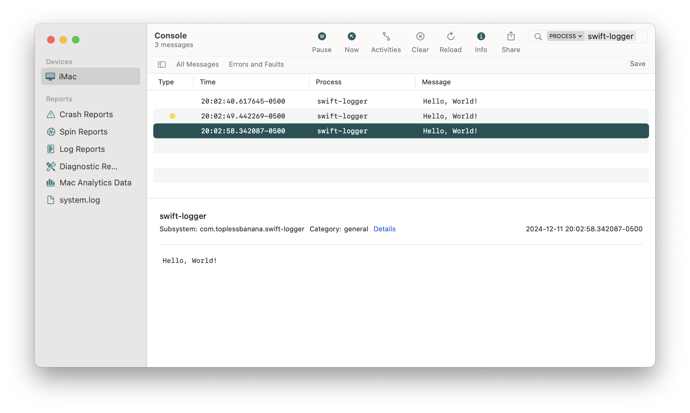

# swift-logger

```
$ swift-logger --help

OVERVIEW: A command-line tool for writing to the unified logging system.

USAGE: swift-logger <message> [--level <level>] [--subsystem <subsystem>] [--category <category>]

ARGUMENTS:
  <message>               The message to be logged.

OPTIONS:
  --level <level>         Specify the log level. (values: default, info, debug,
                          error, fault; default: default)
  --subsystem <subsystem> Specify the subsystem.
  --category <category>   Specify the category.
  --version               Show the version.
  -h, --help              Show help information.
```

## Example

```
$ swift-logger 'Hello, World!'
$ swift-logger 'Hello, World!' --level 'error'
$ swift-logger 'Hello, World!' --subsystem 'com.toplessbanana.swift-logger' --category 'general'
```


